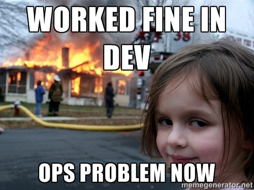
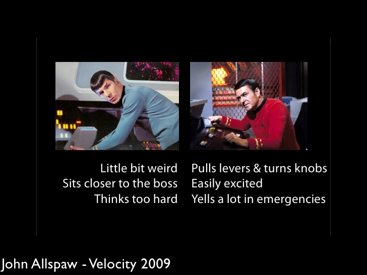

% What is DevOps
% Will Thames
% 10 December 2015

# DevOps

> DevOps is Developers and Operations working together
  for the good of the business

# DevOps

* A bit like Agile in that it extends the Definition
  of Done

# A little bit of history

* [10 deploys a day](https://www.youtube.com/watch?v=LdOe18KhtT4)!
* [DevOps is coined and DevOpsDays born](https://blog.newrelic.com/2014/05/16/devops-name/)
* [Continuous Delivery](http://continuousdelivery.com)

<aside class="notes">
Incredibly, DevOps is short for Agile Systems Infrastructure
</aside>

# This is all obvious, right?

* Misaligned incentives held us back

<aside class="notes">
Developers are incentivized to deliver
features (bonuses and sense of achievement)
Operations are incentivized to maintain
availability (bonuses and being paged)
</aside>

# Is DevOps just Continuous Delivery?

<aside class="notes">
* Continuous Delivery relies on DevOps.
  You'll struggle to attain it without
  the other key elements...
</aside>

# CAMS

- Culture
- Automation
- Measurement
- Sharing

<aside class="notes">
culture: trust, collaboration, continuous improvement
automation: ability to provision and deploy without manual
  steps
measurement: knowing what the business goals are and whether
  your improvemts are adding business value
sharing: using the same source control, the same automation,
  the same measuring systems and the same targets
</aside>

# What have we done

* Completely open automation
* Developers contributing to automation
* Repeatable provisioning and deployment
* Coding standards for automation

# Where would we like to go

* Automated testing of automation (turtles all the way down)
* Developers pushing to production ( == Developers oncall)
* Complete self-service
